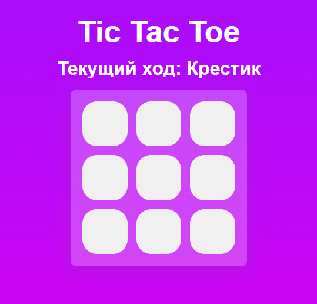

# Tic-Tac-Toe - React + TypeScript



## Описание

Это классическая игра "Крестики-Нолики" с полем 3x3. Игроки поочередно ставят крестики и нолики на игровое поле, стараясь составить ряд из трёх одинаковых символов по горизонтали, вертикали или диагонали.

### Основные функции:
- **Отображение текущего хода**: Игра отображает, чей сейчас ход — крестиков или ноликов.
- **Результат игры**: После каждого хода проверяется, есть ли победитель или ничья, с соответствующим уведомлением.
- **Перезапуск игры**: Возможность начать новую игру после завершения текущей.
- **Анимации**: Приложение содержит анимации, добавленные с помощью Framer Motion, для плавных переходов и эффектов.

## Использованные технологии

<p align="left">
  <a href="https://react.dev/" target="_blank">
    
  </a>
  <a href="https://www.typescriptlang.org/" target="_blank">
    
  </a>
  <a href="https://vitejs.dev/" target="_blank">
    
  </a>
  <a href="https://redux-toolkit.js.org/" target="_blank">
    
  </a>
  <a href="https://styled-components.com/" target="_blank">
    
  </a>
  <a href="https://www.framer.com/motion/" target="_blank">
    
  </a>
</p>

## Демо

Приложение доступно по следующей ссылке:

[Tic Tac Toe - gitHub Pages](https://blinklay.github.io/tic-tac-ts/)

## Установка и запуск

Для локального запуска выполните следующие шаги:

1. Клонируйте репозиторий:

    ```bash
    git clone https://github.com/blinklay/tic-tac-ts.git
    ```

2. Перейдите в директорию проекта:

    ```bash
    cd tic-tac-ts
    ```

3. Установите зависимости:

    ```bash
    npm install
    ```

4. Запустите приложение:

    ```bash
    npm run dev
    ```

Приложение будет доступно по адресу `http://localhost:3000`.

